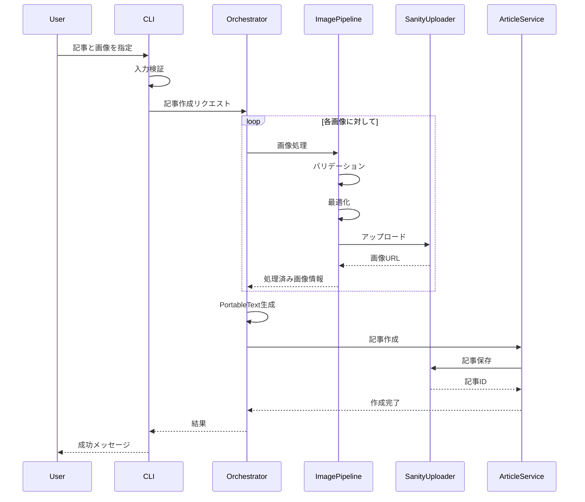

# 画像アップロードシステム アーキテクチャ設計書

## 概要

本設計書は、ブログ記事投稿システムに画像アップロード機能を追加するための全体アーキテクチャを定義します。
長期的な運用性、拡張性、保守性を重視した設計となっています。

## 設計原則

1. **関心の分離（Separation of Concerns）**
   - 各モジュールは単一の責任を持つ
   - レイヤー間の依存関係を明確化

2. **依存性逆転の原則（Dependency Inversion Principle）**
   - 抽象に依存し、具象に依存しない
   - インターフェースを通じた疎結合

3. **開放閉鎖原則（Open/Closed Principle）**
   - 拡張に対して開き、修正に対して閉じた設計
   - 新しいメディアタイプの追加が容易

4. **設定の外部化**
   - ハードコーディングを排除
   - 環境別の設定管理

5. **エラーハンドリングファースト**
   - 予測可能なエラーケースの明示的な処理
   - ユーザーフレンドリーなエラーメッセージ

## システムアーキテクチャ

### レイヤー構造

```
┌─────────────────────────────────────────────────┐
│           Presentation Layer (CLI)              │
│  - Interactive CLI Interface                    │
│  - Progress Indication                          │
│  - User Input Validation                        │
├─────────────────────────────────────────────────┤
│          Application Layer                      │
│  - Article Creation Orchestrator                │
│  - Image Processing Pipeline                    │
│  - Content Transformation                       │
├─────────────────────────────────────────────────┤
│          Domain Layer                           │
│  - Article Entity                               │
│  - Image Entity                                 │
│  - Business Rules                               │
├─────────────────────────────────────────────────┤
│        Infrastructure Layer                     │
│  - Sanity Client Adapter                        │
│  - File System Adapter                          │
│  - Image Processing Service                     │
└─────────────────────────────────────────────────┘
```

### モジュール構成

```
frontend/src/
├── lib/
│   ├── core/
│   │   ├── errors/
│   │   │   ├── base-error.ts
│   │   │   ├── image-error.ts
│   │   │   └── sanity-error.ts
│   │   ├── logging/
│   │   │   ├── logger.interface.ts
│   │   │   ├── console-logger.ts
│   │   │   └── file-logger.ts
│   │   └── config/
│   │       ├── config.interface.ts
│   │       ├── environment-config.ts
│   │       └── image-config.ts
│   │
│   ├── domain/
│   │   ├── entities/
│   │   │   ├── article.ts
│   │   │   ├── image.ts
│   │   │   └── media.interface.ts
│   │   └── services/
│   │       ├── article-service.ts
│   │       └── media-service.interface.ts
│   │
│   ├── infrastructure/
│   │   ├── sanity/
│   │   │   ├── sanity-client.interface.ts
│   │   │   ├── sanity-image-uploader.ts
│   │   │   └── sanity-article-publisher.ts
│   │   ├── file-system/
│   │   │   ├── file-reader.ts
│   │   │   └── file-validator.ts
│   │   └── image-processing/
│   │       ├── image-processor.interface.ts
│   │       ├── sharp-processor.ts
│   │       └── image-optimizer.ts
│   │
│   └── application/
│       ├── use-cases/
│       │   ├── create-article-with-images.ts
│       │   ├── upload-image.ts
│       │   └── analyze-image-content.ts
│       ├── services/
│       │   ├── portable-text-converter.ts
│       │   └── image-placement-strategy.ts
│       └── dto/
│           ├── article-creation.dto.ts
│           └── image-upload.dto.ts
│
└── scripts/
    └── create-article-with-images.ts
```

## 主要コンポーネント設計

### 1. 画像処理パイプライン

```typescript
interface ImageProcessor {
  validate(file: Buffer, metadata: ImageMetadata): Promise<ValidationResult>
  optimize(file: Buffer, options: OptimizationOptions): Promise<ProcessedImage>
  generateAlt(file: Buffer): Promise<string>
}

interface ImageUploader {
  upload(image: ProcessedImage): Promise<UploadedImage>
  delete(imageId: string): Promise<void>
}

class ImagePipeline {
  constructor(
    private processor: ImageProcessor,
    private uploader: ImageUploader,
    private logger: Logger
  ) {}

  async process(filePath: string): Promise<UploadedImage> {
    // 1. ファイル読み込み
    // 2. バリデーション
    // 3. 最適化
    // 4. アップロード
    // 5. メタデータ返却
  }
}
```

### 2. 記事作成オーケストレーター

```typescript
interface ArticleCreationOptions {
  title: string
  content: string
  images: ImageReference[]
  category: string
  tags: string[]
  imageStrategy: ImagePlacementStrategy
}

class ArticleCreationOrchestrator {
  constructor(
    private articleService: ArticleService,
    private imagePipeline: ImagePipeline,
    private textConverter: PortableTextConverter,
    private logger: Logger
  ) {}

  async createArticleWithImages(options: ArticleCreationOptions): Promise<Article> {
    // 1. 画像アップロード
    // 2. コンテンツ変換（画像参照を含む）
    // 3. 記事作成
    // 4. 公開
  }
}
```

### 3. 設定管理システム

```typescript
interface ImageUploadConfig {
  maxFileSize: number
  allowedFormats: string[]
  optimizationQuality: number
  autoGenerateAlt: boolean
}

interface SystemConfig {
  sanity: SanityConfig
  image: ImageUploadConfig
  logging: LoggingConfig
}

class ConfigurationManager {
  private static instance: ConfigurationManager
  private config: SystemConfig

  static getInstance(): ConfigurationManager {
    // シングルトン実装
  }

  getImageConfig(): ImageUploadConfig {
    return this.config.image
  }
}
```

### 4. エラーハンドリング戦略

```typescript
abstract class BaseError extends Error {
  constructor(
    message: string,
    public code: string,
    public statusCode: number,
    public isOperational: boolean = true
  ) {
    super(message)
    Error.captureStackTrace(this, this.constructor)
  }
}

class ImageValidationError extends BaseError {
  constructor(message: string, public validationErrors: ValidationError[]) {
    super(message, 'IMAGE_VALIDATION_ERROR', 400)
  }
}

class ImageUploadError extends BaseError {
  constructor(message: string, public cause?: Error) {
    super(message, 'IMAGE_UPLOAD_ERROR', 500)
  }
}
```

## データフロー

### 画像付き記事作成フロー



## 設定項目

### 環境変数

```env
# 既存の設定
VITE_SANITY_PROJECT_ID=
VITE_SANITY_DATASET=
VITE_SANITY_API_VERSION=
VITE_SANITY_TOKEN=

# 画像アップロード関連
IMAGE_MAX_FILE_SIZE=10485760  # 10MB
IMAGE_ALLOWED_FORMATS=jpg,jpeg,png,webp,gif
IMAGE_OPTIMIZATION_QUALITY=85
IMAGE_AUTO_GENERATE_ALT=true
IMAGE_RESIZE_MAX_WIDTH=1920
IMAGE_RESIZE_MAX_HEIGHT=1080

# ロギング関連
LOG_LEVEL=info
LOG_FILE_PATH=./logs/image-upload.log
LOG_MAX_FILE_SIZE=10485760
LOG_RETENTION_DAYS=30
```

### デフォルト設定

```typescript
const DEFAULT_IMAGE_CONFIG: ImageUploadConfig = {
  maxFileSize: 10 * 1024 * 1024, // 10MB
  allowedFormats: ['jpg', 'jpeg', 'png', 'webp', 'gif'],
  optimizationQuality: 85,
  autoGenerateAlt: true,
  resize: {
    maxWidth: 1920,
    maxHeight: 1080,
    maintainAspectRatio: true
  }
}
```

## 拡張ポイント

### 1. 新しいメディアタイプの追加

```typescript
interface MediaProcessor<T extends Media> {
  process(file: Buffer): Promise<T>
}

// 将来的な実装例
class VideoProcessor implements MediaProcessor<Video> {
  async process(file: Buffer): Promise<Video> {
    // 動画処理ロジック
  }
}
```

### 2. 画像配置戦略のカスタマイズ

```typescript
interface ImagePlacementStrategy {
  placeImages(content: string, images: UploadedImage[]): PortableTextBlock[]
}

// 実装例
class SmartPlacementStrategy implements ImagePlacementStrategy {
  placeImages(content: string, images: UploadedImage[]): PortableTextBlock[] {
    // AIを使った最適な画像配置
  }
}
```

### 3. カスタムバリデーター

```typescript
interface Validator<T> {
  validate(value: T): ValidationResult
}

// 実装例
class ContentPolicyValidator implements Validator<Buffer> {
  validate(imageBuffer: Buffer): ValidationResult {
    // コンテンツポリシーチェック
  }
}
```

## パフォーマンス考慮事項

1. **並列処理**
   - 複数画像の並列アップロード
   - Promise.allSettled()を使用したエラーハンドリング

2. **キャッシング**
   - 処理済み画像のキャッシュ
   - 設定値のキャッシュ

3. **リトライメカニズム**
   - 指数バックオフによるリトライ
   - 最大リトライ回数の設定

4. **メモリ管理**
   - ストリーミング処理による大容量ファイル対応
   - メモリリークの防止

## セキュリティ考慮事項

1. **入力検証**
   - ファイルタイプの厳密な検証
   - ファイルサイズ制限
   - パストラバーサル攻撃の防止

2. **アクセス制御**
   - Sanityトークンの安全な管理
   - 環境変数の暗号化

3. **監査ログ**
   - すべてのアップロード操作のログ記録
   - エラーイベントの詳細記録

## テスト戦略

1. **単体テスト**
   - 各モジュールの独立したテスト
   - モックを使用した依存性の分離

2. **統合テスト**
   - エンドツーエンドのフロー検証
   - 実際のSanity環境でのテスト

3. **パフォーマンステスト**
   - 大容量ファイルの処理時間測定
   - 並列処理の効率性検証

## 移行計画

1. **フェーズ1: 基盤整備**
   - コアモジュールの実装
   - 既存システムとの統合準備

2. **フェーズ2: 機能実装**
   - 画像アップロード機能の実装
   - CLIインターフェースの更新

3. **フェーズ3: 拡張機能**
   - AI画像解析機能
   - 自動配置機能

## まとめ

この設計により、以下が実現されます：

- **保守性**: モジュール化された構造により、各部分の独立した更新が可能
- **拡張性**: インターフェースベースの設計により、新機能の追加が容易
- **信頼性**: 包括的なエラーハンドリングとロギング
- **パフォーマンス**: 並列処理とキャッシングによる高速化
- **セキュリティ**: 多層防御による安全性の確保