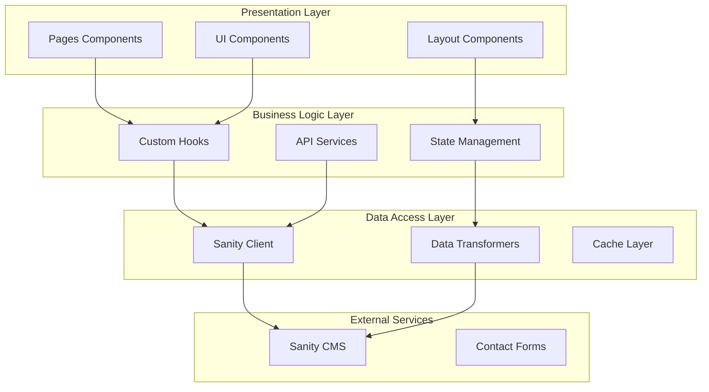
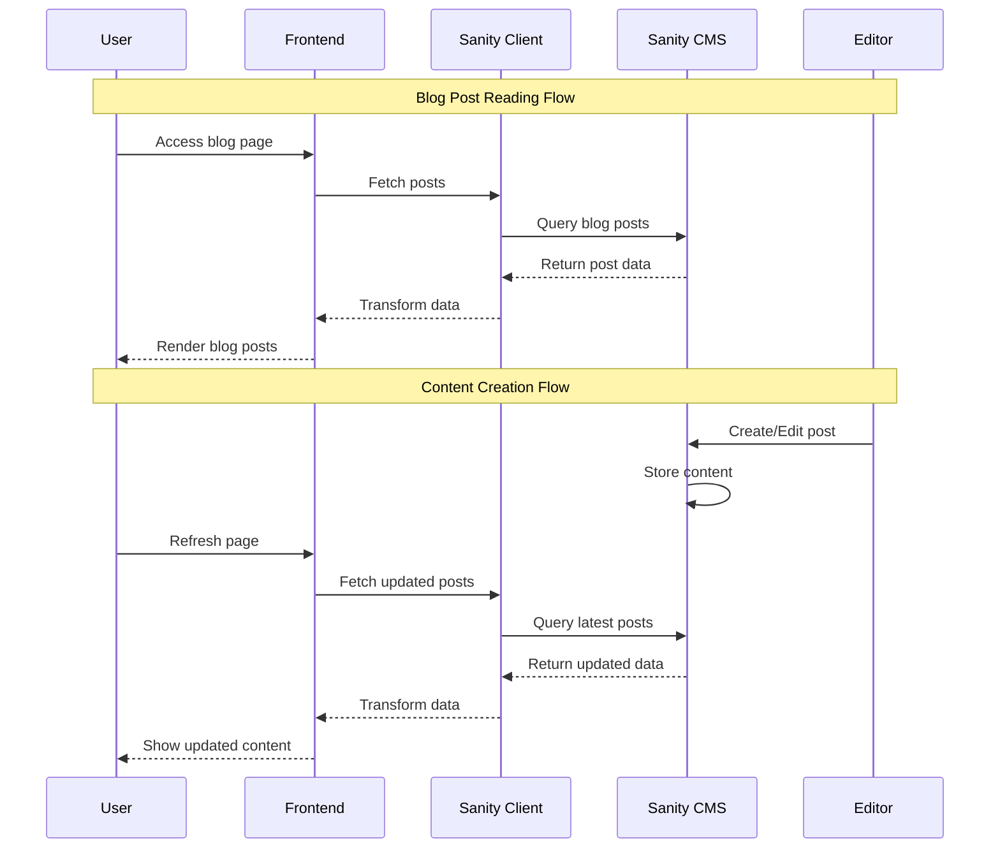
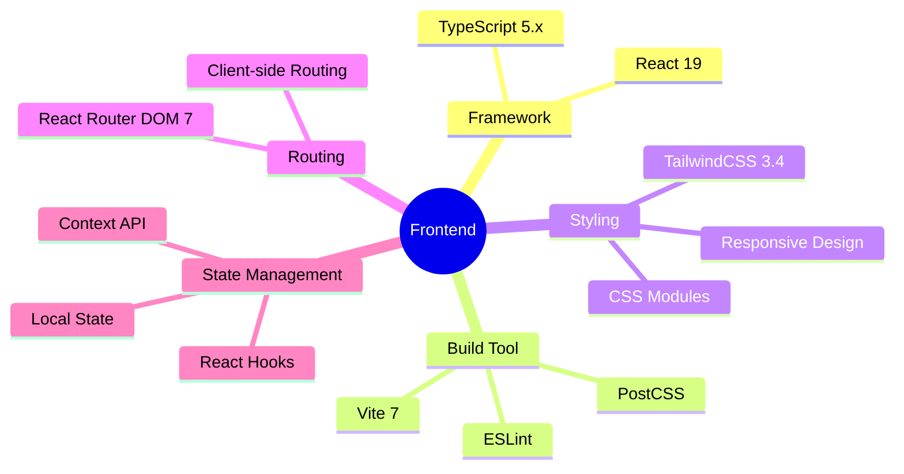
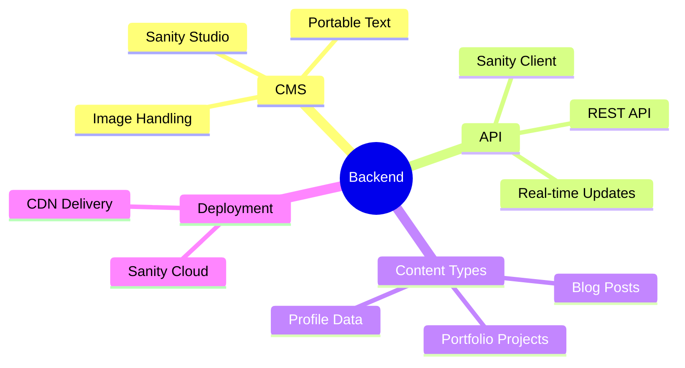
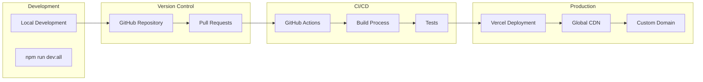

```mermaid
graph TB
    subgraph "Frontend"
        A[React 19 + TypeScript]
        B[TailwindCSS]
        C[React Router DOM]
        D[Vite Build Tool]
    end
    
    subgraph "CMS"
        E[Sanity Studio]
        F[Sanity Cloud]
    end
    
    subgraph "Deployment"
        G[Vercel Frontend]
        H[Sanity Hosting]
    end
    
    subgraph "User Interaction"
        I[Web Browser]
        J[Content Editor]
    end
    
    I --> A
    A --> F
    J --> E
    E --> F
    A --> G
    E --> H
    
    style A fill:#61DAFB
    style E fill:#F03E2F
    style G fill:#000000
    style I fill:#FF6B6B
```

# 🏗️ システム構成・アーキテクチャ

## 📊 システム概要図



## 🏛️ レイヤードアーキテクチャ



## 📱 コンポーネント構成

```mermaid
graph TD
    subgraph "App Structure"
        App[App.tsx]
        Router[React Router]
    end
    
    subgraph "Layout"
        Layout[Layout Components]
        Nav[Navigation]
        Footer[Footer]
    end
    
    subgraph "Pages"
        Home[Home Page]
        Blog[Blog Pages]
        Portfolio[Portfolio Page]
        Profile[Profile Page]
        Contact[Contact Page]
    end
    
    subgraph "Shared Components"
        UI[UI Components]
        SEO[SEO Components]
        Dark[Dark Mode Toggle]
    end
    
    App --> Router
    Router --> Layout
    Layout --> Nav
    Layout --> Pages
    Layout --> Footer
    Pages --> Home
    Pages --> Blog
    Pages --> Portfolio
    Pages --> Profile
    Pages --> Contact
    Pages --> UI
    Pages --> SEO
    Nav --> Dark
```

## 🔄 データフロー



## 🛠️ 技術スタック詳細

### Frontend Stack


### Backend & CMS


## 📂 ファイル構成詳細

```
frontend/src/
├── components/           # 再利用可能コンポーネント
│   ├── layout/          # レイアウト関連
│   │   └── Navigation.tsx
│   └── ui/              # UIコンポーネント
│       ├── Button.tsx
│       └── Card.tsx
├── pages/               # ページコンポーネント
│   ├── Home.tsx
│   ├── BlogList.tsx
│   ├── BlogPost.tsx
│   ├── Portfolio.tsx
│   ├── Profile.tsx
│   └── Contact.tsx
├── lib/                 # ユーティリティ・設定
│   ├── sanity.ts       # Sanity クライアント設定
│   └── data.ts         # データ取得関数
├── types/              # TypeScript型定義
│   ├── post.ts
│   └── portfolio.ts
├── data/               # 静的データ
│   ├── profile.ts
│   └── projects.ts
└── assets/             # 静的アセット
    └── images/
```

## 🚀 デプロイメント構成



## 🔧 開発ワークフロー

```mermaid
gitgraph
    commit id: "Initial Setup"
    commit id: "Basic Components"
    branch feature/blog
    commit id: "Blog Implementation"
    commit id: "Sanity Integration"
    checkout main
    merge feature/blog
    commit id: "Blog Complete"
    branch feature/portfolio
    commit id: "Portfolio Pages"
    commit id: "Project Gallery"
    checkout main
    merge feature/portfolio
    commit id: "Portfolio Complete"
    commit id: "Production Deploy"
```

## 📊 パフォーマンス最適化

### Core Web Vitals 戦略
- **LCP (Largest Contentful Paint)**: < 2.5s
  - 画像最適化 (WebP, lazy loading)
  - コードスプリッティング
  - CDN活用

- **FID (First Input Delay)**: < 100ms
  - JavaScript最適化
  - 非同期ローディング
  - イベントハンドラー最適化

- **CLS (Cumulative Layout Shift)**: < 0.1
  - レイアウト固定
  - フォント表示最適化
  - 画像サイズ指定

### Bundle Size 最適化
- Tree shaking
- Dynamic imports
- Vendor chunk分離
- 不要なライブラリ除去

---

このアーキテクチャ図は開発の進行に合わせて更新されます。