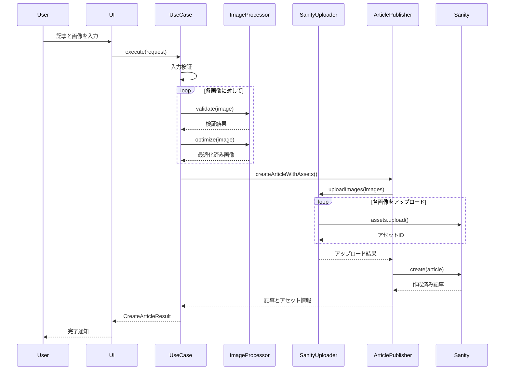

# 画像アップロードシステム アーキテクチャ

## 📋 概要

クリーンアーキテクチャに基づいた画像アップロード機能付き記事投稿システムです。

## 🏗 システム構成図

**Excalidraw で作成:** https://excalidraw.com

```json
{
  "type": "excalidraw",
  "version": 2,
  "source": "https://excalidraw.com",
  "elements": [
    {
      "type": "rectangle",
      "version": 1,
      "versionNonce": 1,
      "isDeleted": false,
      "id": "ui-layer",
      "fillStyle": "solid",
      "strokeWidth": 2,
      "strokeStyle": "solid",
      "roughness": 1,
      "opacity": 100,
      "angle": 0,
      "x": 100,
      "y": 50,
      "strokeColor": "#1e40af",
      "backgroundColor": "#3B82F6",
      "width": 200,
      "height": 60,
      "seed": 1
    },
    {
      "type": "text",
      "version": 1,
      "versionNonce": 1,
      "isDeleted": false,
      "id": "ui-text",
      "fillStyle": "solid",
      "strokeWidth": 2,
      "strokeStyle": "solid",
      "roughness": 1,
      "opacity": 100,
      "angle": 0,
      "x": 150,
      "y": 70,
      "strokeColor": "#ffffff",
      "backgroundColor": "transparent",
      "width": 100,
      "height": 20,
      "seed": 1,
      "text": "記事作成UI",
      "fontSize": 16,
      "fontFamily": 1,
      "textAlign": "center",
      "verticalAlign": "middle"
    },
    {
      "type": "rectangle",
      "version": 1,
      "versionNonce": 1,
      "isDeleted": false,
      "id": "usecase-layer",
      "fillStyle": "solid",
      "strokeWidth": 2,
      "strokeStyle": "solid",
      "roughness": 1,
      "opacity": 100,
      "angle": 0,
      "x": 100,
      "y": 150,
      "strokeColor": "#6b21a8",
      "backgroundColor": "#8B5CF6",
      "width": 200,
      "height": 60,
      "seed": 1
    },
    {
      "type": "text",
      "version": 1,
      "versionNonce": 1,
      "isDeleted": false,
      "id": "usecase-text",
      "fillStyle": "solid",
      "strokeWidth": 2,
      "strokeStyle": "solid",
      "roughness": 1,
      "opacity": 100,
      "angle": 0,
      "x": 140,
      "y": 170,
      "strokeColor": "#ffffff",
      "backgroundColor": "transparent",
      "width": 120,
      "height": 20,
      "seed": 1,
      "text": "Use Case Layer",
      "fontSize": 16,
      "fontFamily": 1,
      "textAlign": "center",
      "verticalAlign": "middle"
    },
    {
      "type": "rectangle",
      "version": 1,
      "versionNonce": 1,
      "isDeleted": false,
      "id": "domain-layer",
      "fillStyle": "solid",
      "strokeWidth": 2,
      "strokeStyle": "solid",
      "roughness": 1,
      "opacity": 100,
      "angle": 0,
      "x": 100,
      "y": 250,
      "strokeColor": "#047857",
      "backgroundColor": "#10B981",
      "width": 200,
      "height": 60,
      "seed": 1
    },
    {
      "type": "text",
      "version": 1,
      "versionNonce": 1,
      "isDeleted": false,
      "id": "domain-text",
      "fillStyle": "solid",
      "strokeWidth": 2,
      "strokeStyle": "solid",
      "roughness": 1,
      "opacity": 100,
      "angle": 0,
      "x": 140,
      "y": 270,
      "strokeColor": "#ffffff",
      "backgroundColor": "transparent",
      "width": 120,
      "height": 20,
      "seed": 1,
      "text": "Domain Layer",
      "fontSize": 16,
      "fontFamily": 1,
      "textAlign": "center",
      "verticalAlign": "middle"
    },
    {
      "type": "rectangle",
      "version": 1,
      "versionNonce": 1,
      "isDeleted": false,
      "id": "infra-layer",
      "fillStyle": "solid",
      "strokeWidth": 2,
      "strokeStyle": "solid",
      "roughness": 1,
      "opacity": 100,
      "angle": 0,
      "x": 350,
      "y": 200,
      "strokeColor": "#d97706",
      "backgroundColor": "#F59E0B",
      "width": 200,
      "height": 100,
      "seed": 1
    },
    {
      "type": "text",
      "version": 1,
      "versionNonce": 1,
      "isDeleted": false,
      "id": "infra-text",
      "fillStyle": "solid",
      "strokeWidth": 2,
      "strokeStyle": "solid",
      "roughness": 1,
      "opacity": 100,
      "angle": 0,
      "x": 380,
      "y": 220,
      "strokeColor": "#ffffff",
      "backgroundColor": "transparent",
      "width": 140,
      "height": 60,
      "seed": 1,
      "text": "Infrastructure\nLayer",
      "fontSize": 16,
      "fontFamily": 1,
      "textAlign": "center",
      "verticalAlign": "middle"
    },
    {
      "type": "rectangle",
      "version": 1,
      "versionNonce": 1,
      "isDeleted": false,
      "id": "core-layer",
      "fillStyle": "solid",
      "strokeWidth": 2,
      "strokeStyle": "solid",
      "roughness": 1,
      "opacity": 100,
      "angle": 0,
      "x": 100,
      "y": 350,
      "strokeColor": "#dc2626",
      "backgroundColor": "#EF4444",
      "width": 200,
      "height": 60,
      "seed": 1
    },
    {
      "type": "text",
      "version": 1,
      "versionNonce": 1,
      "isDeleted": false,
      "id": "core-text",
      "fillStyle": "solid",
      "strokeWidth": 2,
      "strokeStyle": "solid",
      "roughness": 1,
      "opacity": 100,
      "angle": 0,
      "x": 150,
      "y": 370,
      "strokeColor": "#ffffff",
      "backgroundColor": "transparent",
      "width": 100,
      "height": 20,
      "seed": 1,
      "text": "Core Layer",
      "fontSize": 16,
      "fontFamily": 1,
      "textAlign": "center",
      "verticalAlign": "middle"
    },
    {
      "type": "rectangle",
      "version": 1,
      "versionNonce": 1,
      "isDeleted": false,
      "id": "sanity-cms",
      "fillStyle": "solid",
      "strokeWidth": 2,
      "strokeStyle": "solid",
      "roughness": 1,
      "opacity": 100,
      "angle": 0,
      "x": 600,
      "y": 150,
      "strokeColor": "#ec4899",
      "backgroundColor": "#F472B6",
      "width": 150,
      "height": 80,
      "seed": 1
    },
    {
      "type": "text",
      "version": 1,
      "versionNonce": 1,
      "isDeleted": false,
      "id": "sanity-text",
      "fillStyle": "solid",
      "strokeWidth": 2,
      "strokeStyle": "solid",
      "roughness": 1,
      "opacity": 100,
      "angle": 0,
      "x": 640,
      "y": 180,
      "strokeColor": "#ffffff",
      "backgroundColor": "transparent",
      "width": 70,
      "height": 20,
      "seed": 1,
      "text": "Sanity CMS",
      "fontSize": 14,
      "fontFamily": 1,
      "textAlign": "center",
      "verticalAlign": "middle"
    },
    {
      "type": "rectangle",
      "version": 1,
      "versionNonce": 1,
      "isDeleted": false,
      "id": "storage",
      "fillStyle": "solid",
      "strokeWidth": 2,
      "strokeStyle": "solid",
      "roughness": 1,
      "opacity": 100,
      "angle": 0,
      "x": 600,
      "y": 280,
      "strokeColor": "#4b5563",
      "backgroundColor": "#6B7280",
      "width": 150,
      "height": 60,
      "seed": 1
    },
    {
      "type": "text",
      "version": 1,
      "versionNonce": 1,
      "isDeleted": false,
      "id": "storage-text",
      "fillStyle": "solid",
      "strokeWidth": 2,
      "strokeStyle": "solid",
      "roughness": 1,
      "opacity": 100,
      "angle": 0,
      "x": 620,
      "y": 300,
      "strokeColor": "#ffffff",
      "backgroundColor": "transparent",
      "width": 110,
      "height": 20,
      "seed": 1,
      "text": "Assets Storage",
      "fontSize": 14,
      "fontFamily": 1,
      "textAlign": "center",
      "verticalAlign": "middle"
    },
    {
      "type": "arrow",
      "version": 1,
      "versionNonce": 1,
      "isDeleted": false,
      "id": "arrow-ui-usecase",
      "fillStyle": "solid",
      "strokeWidth": 2,
      "strokeStyle": "solid",
      "roughness": 1,
      "opacity": 100,
      "angle": 0,
      "x": 200,
      "y": 110,
      "strokeColor": "#1f2937",
      "backgroundColor": "transparent",
      "width": 0,
      "height": 40,
      "seed": 1,
      "startBinding": null,
      "endBinding": null,
      "points": [[0, 0], [0, 40]],
      "lastCommittedPoint": [0, 40]
    },
    {
      "type": "arrow",
      "version": 1,
      "versionNonce": 1,
      "isDeleted": false,
      "id": "arrow-usecase-domain",
      "fillStyle": "solid",
      "strokeWidth": 2,
      "strokeStyle": "solid",
      "roughness": 1,
      "opacity": 100,
      "angle": 0,
      "x": 200,
      "y": 210,
      "strokeColor": "#1f2937",
      "backgroundColor": "transparent",
      "width": 0,
      "height": 40,
      "seed": 1,
      "startBinding": null,
      "endBinding": null,
      "points": [[0, 0], [0, 40]],
      "lastCommittedPoint": [0, 40]
    },
    {
      "type": "arrow",
      "version": 1,
      "versionNonce": 1,
      "isDeleted": false,
      "id": "arrow-usecase-infra",
      "fillStyle": "solid",
      "strokeWidth": 2,
      "strokeStyle": "solid",
      "roughness": 1,
      "opacity": 100,
      "angle": 0,
      "x": 300,
      "y": 180,
      "strokeColor": "#1f2937",
      "backgroundColor": "transparent",
      "width": 50,
      "height": 40,
      "seed": 1,
      "startBinding": null,
      "endBinding": null,
      "points": [[0, 0], [50, 40]],
      "lastCommittedPoint": [50, 40]
    },
    {
      "type": "arrow",
      "version": 1,
      "versionNonce": 1,
      "isDeleted": false,
      "id": "arrow-infra-sanity",
      "fillStyle": "solid",
      "strokeWidth": 2,
      "strokeStyle": "solid",
      "roughness": 1,
      "opacity": 100,
      "angle": 0,
      "x": 550,
      "y": 220,
      "strokeColor": "#1f2937",
      "backgroundColor": "transparent",
      "width": 50,
      "height": -30,
      "seed": 1,
      "startBinding": null,
      "endBinding": null,
      "points": [[0, 0], [50, -30]],
      "lastCommittedPoint": [50, -30]
    },
    {
      "type": "arrow",
      "version": 1,
      "versionNonce": 1,
      "isDeleted": false,
      "id": "arrow-sanity-storage",
      "fillStyle": "solid",
      "strokeWidth": 2,
      "strokeStyle": "solid",
      "roughness": 1,
      "opacity": 100,
      "angle": 0,
      "x": 675,
      "y": 230,
      "strokeColor": "#1f2937",
      "backgroundColor": "transparent",
      "width": 0,
      "height": 50,
      "seed": 1,
      "startBinding": null,
      "endBinding": null,
      "points": [[0, 0], [0, 50]],
      "lastCommittedPoint": [0, 50]
    }
  ],
  "appState": {
    "gridSize": null,
    "viewBackgroundColor": "#ffffff"
  },
  "files": {}
}
```

**👆 この JSON を https://excalidraw.com にコピペして開いてください！**

### 📝 使い方
1. https://excalidraw.com を開く
2. 左上の「Open」→「Load from clipboard」
3. 上記JSONをペースト
4. 手書き風の図が表示されます！

### ✨ 図の特徴
- 🎨 手書き風でおしゃれ
- 🌈 レイヤー別に色分け（青→紫→緑→オレンジ→赤）
- ➡️ 依存関係を矢印で表現
- 📱 クリーンアーキテクチャの構造を視覚化

## 📁 レイヤー別構成

### 1. **Use Case Layer** (ビジネスロジック)
```
src/lib/application/use-cases/
└── create-article-with-images.ts
    ├── CreateArticleWithImagesUseCase (メインクラス)
    ├── CreateArticleRequest (入力型)
    └── CreateArticleResult (出力型)
```

**責務:**
- 記事作成フローの制御
- 画像処理の統合
- エラーハンドリング
- 進捗レポート

### 2. **Domain Layer** (ビジネスルール)
```
src/lib/domain/entities/
├── article.ts
│   ├── Article (記事エンティティ)
│   ├── ArticleStatuses (ステータス定数)
│   └── ArticleCategories (カテゴリー定数)
├── image.ts
│   └── Image (画像エンティティ)
└── media.interface.ts
    ├── MediaTypes (メディアタイプ定数)
    ├── ImageFormats (画像フォーマット定数)
    └── ImagePlacements (配置方法定数)
```

**責務:**
- ビジネスエンティティの定義
- ビジネスルールの実装
- 値オブジェクトの管理

### 3. **Infrastructure Layer** (外部連携)
```
src/lib/infrastructure/
├── image-processing/
│   ├── sharp-processor.ts (Sharp実装)
│   └── image-processor.interface.ts
└── sanity/
    ├── sanity-image-uploader.ts
    ├── sanity-article-publisher.ts
    └── sanity-client.interface.ts
```

**責務:**
- 画像処理（Sharp.js）
- Sanity CMS連携
- ファイルI/O操作
- 外部API通信

### 4. **Core Layer** (共通機能)
```
src/lib/core/
├── config/
│   ├── config.interface.ts
│   └── environment-config.ts
├── errors/
│   ├── base-error.ts
│   ├── image-error.ts
│   └── sanity-error.ts
└── logging/
    ├── logger.interface.ts
    └── console-logger.ts
```

**責務:**
- 設定管理
- エラーハンドリング
- ロギング
- 横断的関心事

## 🔄 処理フロー



## 🔧 TypeScript厳格設定対応

### 1. **verbatimModuleSyntax 対応**
```typescript
// ❌ Before
import { LogLevel } from './logger.interface';

// ✅ After
import type { LogLevel } from './logger.interface';
import { LogLevels } from './logger.interface';
```

### 2. **erasableSyntaxOnly 対応**
```typescript
// ❌ Before (enum)
export enum ArticleStatus {
  DRAFT = 'draft',
  PUBLISHED = 'published'
}

// ✅ After (const assertion)
export const ArticleStatuses = {
  DRAFT: 'draft',
  PUBLISHED: 'published'
} as const;

export type ArticleStatus = typeof ArticleStatuses[keyof typeof ArticleStatuses];
```

## 📊 型安全性の向上

### 1. **Sanity型統合**
```typescript
// 型安全なドキュメント作成
toSanityDocument(): Record<string, unknown> & { _type: string } {
  return {
    _type: 'post',
    // ... other fields
  };
}
```

### 2. **段階的型変換**
```typescript
// unknown経由の安全な変換
const createdDocument = await this.client.create(sanityDoc);
return createdDocument as unknown as SanityPost;
```

## 🎯 主要な改善点

1. **クリーンアーキテクチャ採用**
   - 関心事の分離が明確
   - テスタビリティ向上
   - 保守性の改善

2. **型安全性の徹底**
   - any型の完全排除
   - type-only importの適切な使用
   - const assertionパターンの採用

3. **エラーハンドリング強化**
   - カスタムエラークラス階層
   - 詳細なエラー情報
   - 適切なエラー伝播

4. **パフォーマンス最適化**
   - 画像の並列処理
   - プログレス通知
   - メモリ効率的な処理

## 📝 今後の拡張ポイント

1. **AI画像解析機能**
   - 自動altテキスト生成
   - 不適切コンテンツ検出
   - 画像分類

2. **高度な画像処理**
   - WebP自動変換
   - レスポンシブ画像生成
   - 画像CDN統合

3. **ワークフロー機能**
   - 下書き保存
   - プレビュー機能
   - 承認フロー