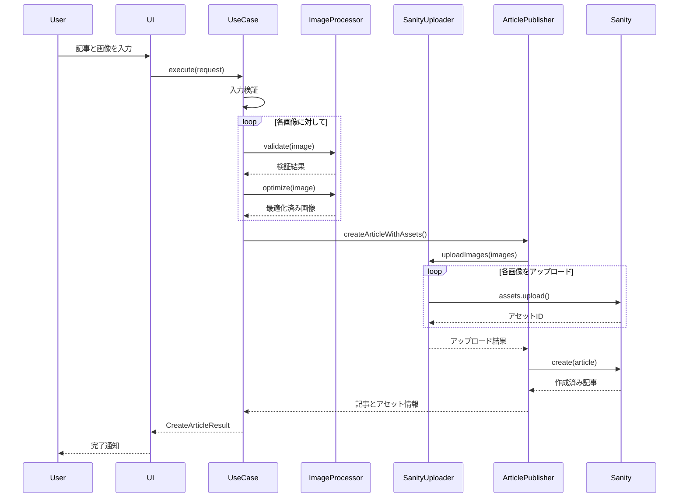

# 画像アップロードシステム アーキテクチャ

## 📋 概要

クリーンアーキテクチャに基づいた画像アップロード機能付き記事投稿システムです。

## 🏗 システム構成図

**Draw.io で作成:** https://app.diagrams.net

### 📋 Draw.io用データ（XMLファイル）

```xml
<mxfile host="app.diagrams.net" modified="2024-01-01T00:00:00.000Z" agent="Claude" etag="123" version="22.1.16">
  <diagram name="画像アップロードシステム" id="architecture">
    <mxGraphModel dx="1422" dy="882" grid="1" gridSize="10" guides="1" tooltips="1" connect="1" arrows="1" fold="1" page="1" pageScale="1" pageWidth="827" pageHeight="1169" math="0" shadow="0">
      <root>
        <mxCell id="0" />
        <mxCell id="1" parent="0" />
        
        <!-- UI Layer -->
        <mxCell id="ui-layer" value="記事作成UI&#xa;(Presentation Layer)" style="rounded=1;whiteSpace=wrap;html=1;fillColor=#3B82F6;fontColor=#ffffff;strokeColor=#1e40af;fontSize=16;fontStyle=1" vertex="1" parent="1">
          <mxGeometry x="200" y="50" width="200" height="60" as="geometry" />
        </mxCell>
        
        <!-- Use Case Layer -->
        <mxCell id="usecase-layer" value="CreateArticleWithImages&#xa;(Use Case Layer)" style="rounded=1;whiteSpace=wrap;html=1;fillColor=#8B5CF6;fontColor=#ffffff;strokeColor=#6b21a8;fontSize=16;fontStyle=1" vertex="1" parent="1">
          <mxGeometry x="200" y="150" width="200" height="60" as="geometry" />
        </mxCell>
        
        <!-- Domain Layer -->
        <mxCell id="domain-layer" value="Article, Image&#xa;(Domain Layer)" style="rounded=1;whiteSpace=wrap;html=1;fillColor=#10B981;fontColor=#ffffff;strokeColor=#047857;fontSize=16;fontStyle=1" vertex="1" parent="1">
          <mxGeometry x="200" y="250" width="200" height="60" as="geometry" />
        </mxCell>
        
        <!-- Infrastructure Layer -->
        <mxCell id="infra-layer" value="Sharp Processor&#xa;Sanity Client&#xa;(Infrastructure Layer)" style="rounded=1;whiteSpace=wrap;html=1;fillColor=#F59E0B;fontColor=#ffffff;strokeColor=#d97706;fontSize=14;fontStyle=1" vertex="1" parent="1">
          <mxGeometry x="450" y="200" width="180" height="80" as="geometry" />
        </mxCell>
        
        <!-- Core Layer -->
        <mxCell id="core-layer" value="Config, Logger, Errors&#xa;(Core Layer)" style="rounded=1;whiteSpace=wrap;html=1;fillColor=#EF4444;fontColor=#ffffff;strokeColor=#dc2626;fontSize=16;fontStyle=1" vertex="1" parent="1">
          <mxGeometry x="200" y="350" width="200" height="60" as="geometry" />
        </mxCell>
        
        <!-- External Services -->
        <mxCell id="sanity-cms" value="Sanity CMS&#xa;API" style="rounded=1;whiteSpace=wrap;html=1;fillColor=#F472B6;fontColor=#ffffff;strokeColor=#ec4899;fontSize=14;fontStyle=1" vertex="1" parent="1">
          <mxGeometry x="700" y="150" width="120" height="60" as="geometry" />
        </mxCell>
        
        <mxCell id="storage" value="Assets Storage&#xa;(Images)" style="rounded=1;whiteSpace=wrap;html=1;fillColor=#6B7280;fontColor=#ffffff;strokeColor=#4b5563;fontSize=14;fontStyle=1" vertex="1" parent="1">
          <mxGeometry x="700" y="250" width="120" height="60" as="geometry" />
        </mxCell>
        
        <!-- Arrows -->
        <mxCell id="arrow1" style="edgeStyle=orthogonalEdgeStyle;rounded=0;orthogonalLoop=1;jettySize=auto;html=1;strokeWidth=2;fillColor=#1f2937;strokeColor=#1f2937;" edge="1" parent="1" source="ui-layer" target="usecase-layer">
          <mxGeometry relative="1" as="geometry" />
        </mxCell>
        
        <mxCell id="arrow2" style="edgeStyle=orthogonalEdgeStyle;rounded=0;orthogonalLoop=1;jettySize=auto;html=1;strokeWidth=2;fillColor=#1f2937;strokeColor=#1f2937;" edge="1" parent="1" source="usecase-layer" target="domain-layer">
          <mxGeometry relative="1" as="geometry" />
        </mxCell>
        
        <mxCell id="arrow3" style="edgeStyle=orthogonalEdgeStyle;rounded=0;orthogonalLoop=1;jettySize=auto;html=1;strokeWidth=2;fillColor=#1f2937;strokeColor=#1f2937;" edge="1" parent="1" source="usecase-layer" target="infra-layer">
          <mxGeometry relative="1" as="geometry" />
        </mxCell>
        
        <mxCell id="arrow4" style="edgeStyle=orthogonalEdgeStyle;rounded=0;orthogonalLoop=1;jettySize=auto;html=1;strokeWidth=2;fillColor=#1f2937;strokeColor=#1f2937;" edge="1" parent="1" source="infra-layer" target="sanity-cms">
          <mxGeometry relative="1" as="geometry" />
        </mxCell>
        
        <mxCell id="arrow5" style="edgeStyle=orthogonalEdgeStyle;rounded=0;orthogonalLoop=1;jettySize=auto;html=1;strokeWidth=2;fillColor=#1f2937;strokeColor=#1f2937;" edge="1" parent="1" source="sanity-cms" target="storage">
          <mxGeometry relative="1" as="geometry" />
        </mxCell>
        
        <mxCell id="arrow6" style="edgeStyle=orthogonalEdgeStyle;rounded=0;orthogonalLoop=1;jettySize=auto;html=1;strokeWidth=2;fillColor=#1f2937;strokeColor=#1f2937;" edge="1" parent="1" source="domain-layer" target="core-layer">
          <mxGeometry relative="1" as="geometry" />
        </mxCell>
        
        <!-- Labels -->
        <mxCell id="title" value="画像アップロードシステム アーキテクチャ" style="text;html=1;strokeColor=none;fillColor=none;align=center;verticalAlign=middle;whiteSpace=wrap;rounded=0;fontSize=18;fontStyle=1;fontColor=#1f2937;" vertex="1" parent="1">
          <mxGeometry x="250" y="10" width="300" height="30" as="geometry" />
        </mxCell>
        
        <mxCell id="clean-arch-label" value="クリーンアーキテクチャ&#xa;依存性の方向: 外側 → 内側" style="text;html=1;strokeColor=none;fillColor=none;align=left;verticalAlign=middle;whiteSpace=wrap;rounded=0;fontSize=12;fontColor=#6b7280;" vertex="1" parent="1">
          <mxGeometry x="50" y="200" width="140" height="40" as="geometry" />
        </mxCell>
        
      </root>
    </mxGraphModel>
  </diagram>
</mxfile>
```

### 📝 使い方
1. **https://app.diagrams.net** を開く
2. 「**新しい図表を作成**」を選択
3. 「**既存の図表から**」→「**Device**」を選択
4. 上記XMLをコピーして「**.drawio**」ファイルとして保存
5. そのファイルをDraw.ioで開く

### ✨ 図の特徴
- 🎨 プロフェッショナルなビジュアル
- 🌈 レイヤー別カラーコーディング
- ➡️ 明確な依存関係表現
- 📋 クリーンアーキテクチャの構造を視覚化
- 🔧 編集・共有が簡単

## 📁 レイヤー別構成

### 1. **Use Case Layer** (ビジネスロジック)
```
src/lib/application/use-cases/
└── create-article-with-images.ts
    ├── CreateArticleWithImagesUseCase (メインクラス)
    ├── CreateArticleRequest (入力型)
    └── CreateArticleResult (出力型)
```

**責務:**
- 記事作成フローの制御
- 画像処理の統合
- エラーハンドリング
- 進捗レポート

### 2. **Domain Layer** (ビジネスルール)
```
src/lib/domain/entities/
├── article.ts
│   ├── Article (記事エンティティ)
│   ├── ArticleStatuses (ステータス定数)
│   └── ArticleCategories (カテゴリー定数)
├── image.ts
│   └── Image (画像エンティティ)
└── media.interface.ts
    ├── MediaTypes (メディアタイプ定数)
    ├── ImageFormats (画像フォーマット定数)
    └── ImagePlacements (配置方法定数)
```

**責務:**
- ビジネスエンティティの定義
- ビジネスルールの実装
- 値オブジェクトの管理

### 3. **Infrastructure Layer** (外部連携)
```
src/lib/infrastructure/
├── image-processing/
│   ├── sharp-processor.ts (Sharp実装)
│   └── image-processor.interface.ts
└── sanity/
    ├── sanity-image-uploader.ts
    ├── sanity-article-publisher.ts
    └── sanity-client.interface.ts
```

**責務:**
- 画像処理（Sharp.js）
- Sanity CMS連携
- ファイルI/O操作
- 外部API通信

### 4. **Core Layer** (共通機能)
```
src/lib/core/
├── config/
│   ├── config.interface.ts
│   └── environment-config.ts
├── errors/
│   ├── base-error.ts
│   ├── image-error.ts
│   └── sanity-error.ts
└── logging/
    ├── logger.interface.ts
    └── console-logger.ts
```

**責務:**
- 設定管理
- エラーハンドリング
- ロギング
- 横断的関心事

## 🔄 処理フロー



## 🔧 TypeScript厳格設定対応

### 1. **verbatimModuleSyntax 対応**
```typescript
// ❌ Before
import { LogLevel } from './logger.interface';

// ✅ After
import type { LogLevel } from './logger.interface';
import { LogLevels } from './logger.interface';
```

### 2. **erasableSyntaxOnly 対応**
```typescript
// ❌ Before (enum)
export enum ArticleStatus {
  DRAFT = 'draft',
  PUBLISHED = 'published'
}

// ✅ After (const assertion)
export const ArticleStatuses = {
  DRAFT: 'draft',
  PUBLISHED: 'published'
} as const;

export type ArticleStatus = typeof ArticleStatuses[keyof typeof ArticleStatuses];
```

## 📊 型安全性の向上

### 1. **Sanity型統合**
```typescript
// 型安全なドキュメント作成
toSanityDocument(): Record<string, unknown> & { _type: string } {
  return {
    _type: 'post',
    // ... other fields
  };
}
```

### 2. **段階的型変換**
```typescript
// unknown経由の安全な変換
const createdDocument = await this.client.create(sanityDoc);
return createdDocument as unknown as SanityPost;
```

## 🎯 主要な改善点

1. **クリーンアーキテクチャ採用**
   - 関心事の分離が明確
   - テスタビリティ向上
   - 保守性の改善

2. **型安全性の徹底**
   - any型の完全排除
   - type-only importの適切な使用
   - const assertionパターンの採用

3. **エラーハンドリング強化**
   - カスタムエラークラス階層
   - 詳細なエラー情報
   - 適切なエラー伝播

4. **パフォーマンス最適化**
   - 画像の並列処理
   - プログレス通知
   - メモリ効率的な処理

## 📝 今後の拡張ポイント

1. **AI画像解析機能**
   - 自動altテキスト生成
   - 不適切コンテンツ検出
   - 画像分類

2. **高度な画像処理**
   - WebP自動変換
   - レスポンシブ画像生成
   - 画像CDN統合

3. **ワークフロー機能**
   - 下書き保存
   - プレビュー機能
   - 承認フロー