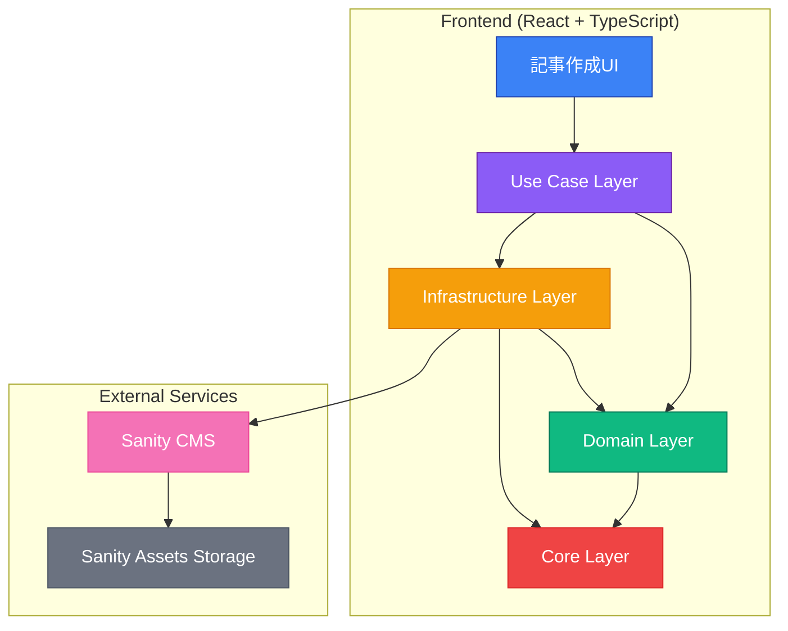
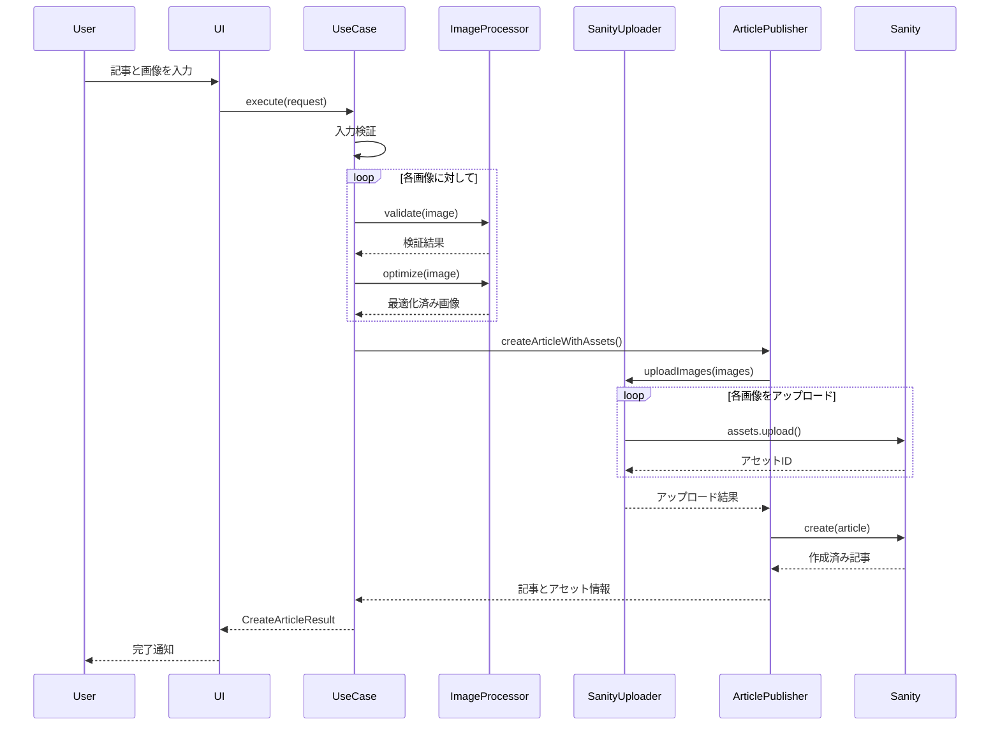

# 画像アップロードシステム アーキテクチャ

## 📋 概要

クリーンアーキテクチャに基づいた画像アップロード機能付き記事投稿システムです。

## 🏗 システム構成図



## 📁 レイヤー別構成

### 1. **Use Case Layer** (ビジネスロジック)
```
src/lib/application/use-cases/
└── create-article-with-images.ts
    ├── CreateArticleWithImagesUseCase (メインクラス)
    ├── CreateArticleRequest (入力型)
    └── CreateArticleResult (出力型)
```

**責務:**
- 記事作成フローの制御
- 画像処理の統合
- エラーハンドリング
- 進捗レポート

### 2. **Domain Layer** (ビジネスルール)
```
src/lib/domain/entities/
├── article.ts
│   ├── Article (記事エンティティ)
│   ├── ArticleStatuses (ステータス定数)
│   └── ArticleCategories (カテゴリー定数)
├── image.ts
│   └── Image (画像エンティティ)
└── media.interface.ts
    ├── MediaTypes (メディアタイプ定数)
    ├── ImageFormats (画像フォーマット定数)
    └── ImagePlacements (配置方法定数)
```

**責務:**
- ビジネスエンティティの定義
- ビジネスルールの実装
- 値オブジェクトの管理

### 3. **Infrastructure Layer** (外部連携)
```
src/lib/infrastructure/
├── image-processing/
│   ├── sharp-processor.ts (Sharp実装)
│   └── image-processor.interface.ts
└── sanity/
    ├── sanity-image-uploader.ts
    ├── sanity-article-publisher.ts
    └── sanity-client.interface.ts
```

**責務:**
- 画像処理（Sharp.js）
- Sanity CMS連携
- ファイルI/O操作
- 外部API通信

### 4. **Core Layer** (共通機能)
```
src/lib/core/
├── config/
│   ├── config.interface.ts
│   └── environment-config.ts
├── errors/
│   ├── base-error.ts
│   ├── image-error.ts
│   └── sanity-error.ts
└── logging/
    ├── logger.interface.ts
    └── console-logger.ts
```

**責務:**
- 設定管理
- エラーハンドリング
- ロギング
- 横断的関心事

## 🔄 処理フロー



## 🔧 TypeScript厳格設定対応

### 1. **verbatimModuleSyntax 対応**
```typescript
// ❌ Before
import { LogLevel } from './logger.interface';

// ✅ After
import type { LogLevel } from './logger.interface';
import { LogLevels } from './logger.interface';
```

### 2. **erasableSyntaxOnly 対応**
```typescript
// ❌ Before (enum)
export enum ArticleStatus {
  DRAFT = 'draft',
  PUBLISHED = 'published'
}

// ✅ After (const assertion)
export const ArticleStatuses = {
  DRAFT: 'draft',
  PUBLISHED: 'published'
} as const;

export type ArticleStatus = typeof ArticleStatuses[keyof typeof ArticleStatuses];
```

## 📊 型安全性の向上

### 1. **Sanity型統合**
```typescript
// 型安全なドキュメント作成
toSanityDocument(): Record<string, unknown> & { _type: string } {
  return {
    _type: 'post',
    // ... other fields
  };
}
```

### 2. **段階的型変換**
```typescript
// unknown経由の安全な変換
const createdDocument = await this.client.create(sanityDoc);
return createdDocument as unknown as SanityPost;
```

## 🎯 主要な改善点

1. **クリーンアーキテクチャ採用**
   - 関心事の分離が明確
   - テスタビリティ向上
   - 保守性の改善

2. **型安全性の徹底**
   - any型の完全排除
   - type-only importの適切な使用
   - const assertionパターンの採用

3. **エラーハンドリング強化**
   - カスタムエラークラス階層
   - 詳細なエラー情報
   - 適切なエラー伝播

4. **パフォーマンス最適化**
   - 画像の並列処理
   - プログレス通知
   - メモリ効率的な処理

## 📝 今後の拡張ポイント

1. **AI画像解析機能**
   - 自動altテキスト生成
   - 不適切コンテンツ検出
   - 画像分類

2. **高度な画像処理**
   - WebP自動変換
   - レスポンシブ画像生成
   - 画像CDN統合

3. **ワークフロー機能**
   - 下書き保存
   - プレビュー機能
   - 承認フロー