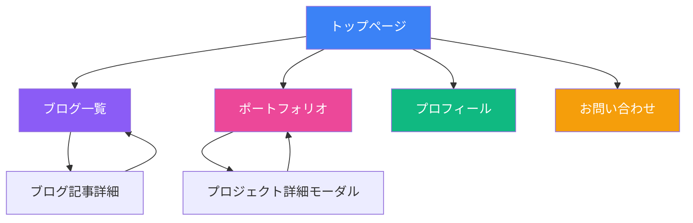

# 📱 サイトモックアップ・画面遷移図

## 🎨 画面遷移フロー



## 📄 各画面のワイヤーフレーム

### 1. 🏠 トップページ

```
┌─────────────────────────────────────────────────────────────┐
│ [ロゴ]                    Home Blog Portfolio Profile Contact│
├─────────────────────────────────────────────────────────────┤
│                                                             │
│                     佐々木のポートフォリオ                    │
│                                                             │
│              フルスタックエンジニア・クリエイター              │
│                                                             │
│            [ポートフォリオを見る] [お問い合わせ]              │
│                                                             │
├─────────────────────────────────────────────────────────────┤
│                      🌟 注目のプロジェクト                    │
│ ┌─────────────┐ ┌─────────────┐ ┌─────────────┐          │
│ │   Project   │ │   Project   │ │   Project   │          │
│ │   Image     │ │   Image     │ │   Image     │          │
│ │             │ │             │ │             │          │
│ │ Project 1   │ │ Project 2   │ │ Project 3   │          │
│ │ Tech Stack  │ │ Tech Stack  │ │ Tech Stack  │          │
│ └─────────────┘ └─────────────┘ └─────────────┘          │
│                                                             │
├─────────────────────────────────────────────────────────────┤
│                      📝 最新のブログ記事                      │
│ ┌─────────────────────────────────────────────────┐        │
│ │ 記事タイトル1                     2024.07.03 │        │
│ │ 記事の概要文がここに表示されます...            │        │
│ └─────────────────────────────────────────────────┘        │
│ ┌─────────────────────────────────────────────────┐        │
│ │ 記事タイトル2                     2024.07.02 │        │
│ │ 記事の概要文がここに表示されます...            │        │
│ └─────────────────────────────────────────────────┘        │
│                      [もっと見る]                           │
└─────────────────────────────────────────────────────────────┘
```

### 2. 📝 ブログ一覧ページ

```
┌─────────────────────────────────────────────────────────────┐
│ [ロゴ]                    Home Blog Portfolio Profile Contact│
├─────────────────────────────────────────────────────────────┤
│                                                             │
│                        📝 ブログ                            │
│                                                             │
│  [検索ボックス]                    [カテゴリフィルタ▼]      │
│                                                             │
├─────────────────────────────────────────────────────────────┤
│ ┌─────────────────────────────────────────────────────────┐│
│ │ 【技術記事】Next.js 14の新機能まとめ                     ││
│ │ 2024年7月3日 • 5分で読める                              ││
│ │                                                         ││
│ │ Next.js 14がリリースされ、App Routerの改善や...        ││
│ └─────────────────────────────────────────────────────────┘│
│ ────────────────────────────────────────────────────────────│
│ ┌─────────────────────────────────────────────────────────┐│
│ │ 【デザイン】UIデザインのトレンド2024                     ││
│ │ 2024年7月2日 • 3分で読める                              ││
│ │                                                         ││
│ │ 2024年のUIデザイントレンドを解説します...               ││
│ └─────────────────────────────────────────────────────────┘│
│ ────────────────────────────────────────────────────────────│
│ ┌─────────────────────────────────────────────────────────┐│
│ │ 【エッセイ】リモートワークとワークライフバランス          ││
│ │ 2024年7月1日 • 7分で読める                              ││
│ │                                                         ││
│ │ 3年間のリモートワーク経験から学んだこと...              ││
│ └─────────────────────────────────────────────────────────┘│
│                                                             │
│              [1] [2] [3] ... [10] [次へ>]                   │
└─────────────────────────────────────────────────────────────┘
```

### 3. 📋 ブログ記事詳細ページ

```
┌─────────────────────────────────────────────────────────────┐
│ [ロゴ]                    Home Blog Portfolio Profile Contact│
├─────────────────────────────────────────────────────────────┤
│  ← ブログ一覧に戻る                                          │
│                                                             │
│        Next.js 14の新機能まとめ                             │
│                                                             │
│        2024年7月3日 • 5分で読める • #技術記事                │
│                                                             │
├─────────────────────────────────────────────────────────────┤
│  目次                                                       │
│  1. はじめに                                                │
│  2. App Routerの改善点                                      │
│  3. パフォーマンスの向上                                     │
│  4. まとめ                                                  │
├─────────────────────────────────────────────────────────────┤
│                                                             │
│  ## はじめに                                                │
│                                                             │
│  Next.js 14がリリースされ、多くの改善が加わりました。       │
│  この記事では主要な変更点について解説します。                │
│                                                             │
│  ## App Routerの改善点                                      │
│                                                             │
│  App Routerに以下の機能が追加されました：                   │
│  - Partial Prerendering（実験的機能）                       │
│  - メタデータAPIの改善                                      │
│  - 画像最適化の強化                                         │
│                                                             │
│  [コードブロック]                                           │
│  ```javascript                                              │
│  export default function Page() {                           │
│    return <h1>Hello, Next.js 14!</h1>                      │
│  }                                                          │
│  ```                                                        │
│                                                             │
├─────────────────────────────────────────────────────────────┤
│  [Twitter] [Facebook] [はてな] [コピー]                     │
│                                                             │
│  ← ブログ一覧に戻る                                          │
└─────────────────────────────────────────────────────────────┘
```

### 4. 💼 ポートフォリオページ

```
┌─────────────────────────────────────────────────────────────┐
│ [ロゴ]                    Home Blog Portfolio Profile Contact│
├─────────────────────────────────────────────────────────────┤
│                                                             │
│                      💼 ポートフォリオ                       │
│                                                             │
│     [すべて] [Web開発] [モバイル] [デザイン] [その他]       │
│                                                             │
├─────────────────────────────────────────────────────────────┤
│ ┌──────────────┐ ┌──────────────┐ ┌──────────────┐       │
│ │              │ │              │ │              │       │
│ │   Project    │ │   Project    │ │   Project    │       │
│ │   Image      │ │   Image      │ │   Image      │       │
│ │              │ │              │ │              │       │
│ ├──────────────┤ ├──────────────┤ ├──────────────┤       │
│ │ ECサイト構築  │ │ タスク管理    │ │ ブログCMS    │       │
│ │              │ │ アプリ        │ │              │       │
│ │ React/Node   │ │ React Native │ │ Next.js      │       │
│ │ [詳細を見る] │ │ [詳細を見る] │ │ [詳細を見る] │       │
│ └──────────────┘ └──────────────┘ └──────────────┘       │
│                                                             │
│ ┌──────────────┐ ┌──────────────┐ ┌──────────────┐       │
│ │              │ │              │ │              │       │
│ │   Project    │ │   Project    │ │   Project    │       │
│ │   Image      │ │   Image      │ │   Image      │       │
│ │              │ │              │ │              │       │
│ ├──────────────┤ ├──────────────┤ ├──────────────┤       │
│ │ 在庫管理     │ │ SNS          │ │ LPデザイン   │       │
│ │ システム     │ │ マーケツール  │ │              │       │
│ │ Vue/Django   │ │ Python/ML    │ │ Figma        │       │
│ │ [詳細を見る] │ │ [詳細を見る] │ │ [詳細を見る] │       │
│ └──────────────┘ └──────────────┘ └──────────────┘       │
└─────────────────────────────────────────────────────────────┘
```

### 5. 👤 プロフィールページ

```
┌─────────────────────────────────────────────────────────────┐
│ [ロゴ]                    Home Blog Portfolio Profile Contact│
├─────────────────────────────────────────────────────────────┤
│                                                             │
│  ┌─────────┐              佐々木 太郎                      │
│  │         │                                               │
│  │  写真   │         フルスタックエンジニア                  │
│  │         │              東京都在住                        │
│  └─────────┘                                               │
│                                                             │
│  [GitHub] [LinkedIn] [Twitter] [Zenn]                      │
│                                                             │
├─────────────────────────────────────────────────────────────┤
│                        自己紹介                             │
│                                                             │
│  10年以上のWeb開発経験を持つフルスタックエンジニアです。     │
│  フロントエンドからバックエンド、インフラまで幅広く対応可能。 │
│  最近はAI/MLの分野にも興味を持ち、個人プロジェクトで        │
│  実験的な開発を行っています。                               │
│                                                             │
├─────────────────────────────────────────────────────────────┤
│                     💻 技術スタック                         │
│                                                             │
│  Frontend:  ████████████████░░░░ 90%  React/Vue/Next.js    │
│  Backend:   ███████████████░░░░░ 85%  Node/Python/Go       │
│  Database:  ██████████████░░░░░░ 80%  MySQL/PostgreSQL     │
│  DevOps:    ████████████░░░░░░░░ 70%  Docker/K8s/AWS      │
│  Design:    ██████████░░░░░░░░░░ 60%  Figma/Adobe XD      │
│                                                             │
├─────────────────────────────────────────────────────────────┤
│                      📅 経歴                                │
│                                                             │
│  2020-現在  ● シニアエンジニア @ テック株式会社             │
│             　 大規模ECサイトのアーキテクチャ設計           │
│                                                             │
│  2018-2020  ● フルスタックエンジニア @ スタートアップA      │
│             　 新規サービスの立ち上げから運用まで担当        │
│                                                             │
│  2015-2018  ● フロントエンドエンジニア @ Web制作会社       │
│             　 企業サイト・LPの制作                         │
└─────────────────────────────────────────────────────────────┘
```

### 6. 📧 お問い合わせページ

```
┌─────────────────────────────────────────────────────────────┐
│ [ロゴ]                    Home Blog Portfolio Profile Contact│
├─────────────────────────────────────────────────────────────┤
│                                                             │
│                      📧 お問い合わせ                        │
│                                                             │
│         お仕事のご依頼・ご相談はこちらからどうぞ             │
│                                                             │
├─────────────────────────────────────────────────────────────┤
│                                                             │
│  お名前 *                                                   │
│  ┌─────────────────────────────────────────────────┐      │
│  │                                                 │      │
│  └─────────────────────────────────────────────────┘      │
│                                                             │
│  メールアドレス *                                           │
│  ┌─────────────────────────────────────────────────┐      │
│  │                                                 │      │
│  └─────────────────────────────────────────────────┘      │
│                                                             │
│  件名 *                                                     │
│  ┌─────────────────────────────────────────────────┐      │
│  │                                                 │      │
│  └─────────────────────────────────────────────────┘      │
│                                                             │
│  お問い合わせ内容 *                                         │
│  ┌─────────────────────────────────────────────────┐      │
│  │                                                 │      │
│  │                                                 │      │
│  │                                                 │      │
│  │                                                 │      │
│  │                                                 │      │
│  └─────────────────────────────────────────────────┘      │
│                                                             │
│              [送信する]    [クリア]                         │
│                                                             │
├─────────────────────────────────────────────────────────────┤
│                    その他の連絡方法                         │
│                                                             │
│  📧 Email: sassan0808@example.com                          │
│  🐦 Twitter: @sassan0808                                   │
│  💼 LinkedIn: linkedin.com/in/sassan0808                   │
└─────────────────────────────────────────────────────────────┘
```

## 🎨 デザインシステム

### カラーパレット
```
Primary:   ■ #3B82F6 (Blue)
Secondary: ■ #8B5CF6 (Purple) 
Accent:    ■ Gradient (Blue→Purple)
Dark BG:   ■ #111827
Light BG:  ■ #F9FAFB
Text:      ■ #1F2937 / #F3F4F6
```

### レスポンシブ対応

**デスクトップ (1200px+)**
- 3カラムレイアウト
- サイドバーナビゲーション可能

**タブレット (768px-1199px)**  
- 2カラムレイアウト
- ハンバーガーメニュー

**スマートフォン (320px-767px)**
- 1カラムレイアウト
- 下部固定ナビゲーション

## 🔄 インタラクション仕様

### ページ遷移
- フェードイン/アウトアニメーション
- ローディング中はスケルトンスクリーン表示

### ホバーエフェクト
- カード: 影の強調 + 少し浮き上がる
- ボタン: 色の変化 + スケール1.05倍
- リンク: アンダーライン表示

### モバイル操作
- スワイプでページ切り替え（ブログ記事）
- プルダウンでリフレッシュ
- 無限スクロール（ブログ一覧）

---

このモックアップは実装の指針として使用し、開発中に随時更新されます。