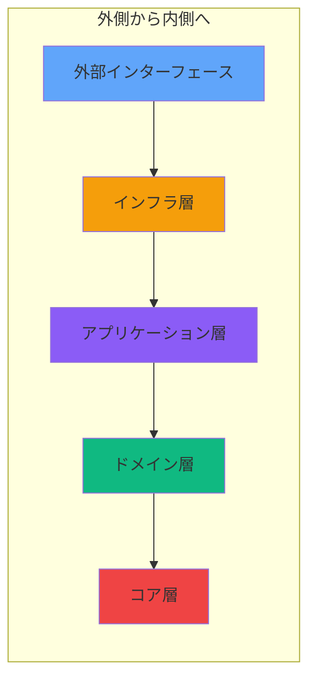
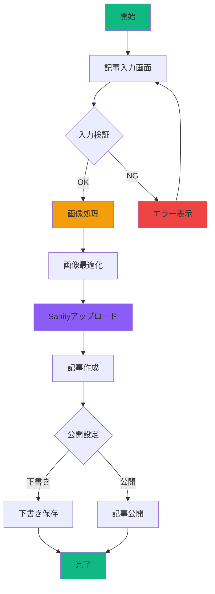
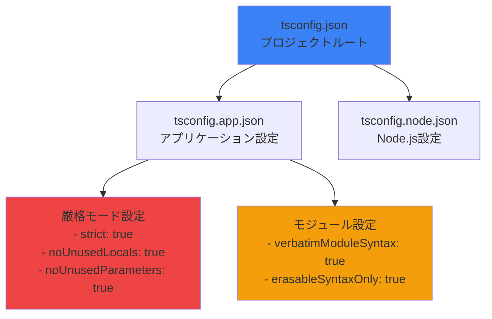
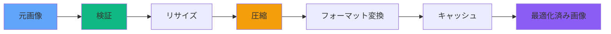
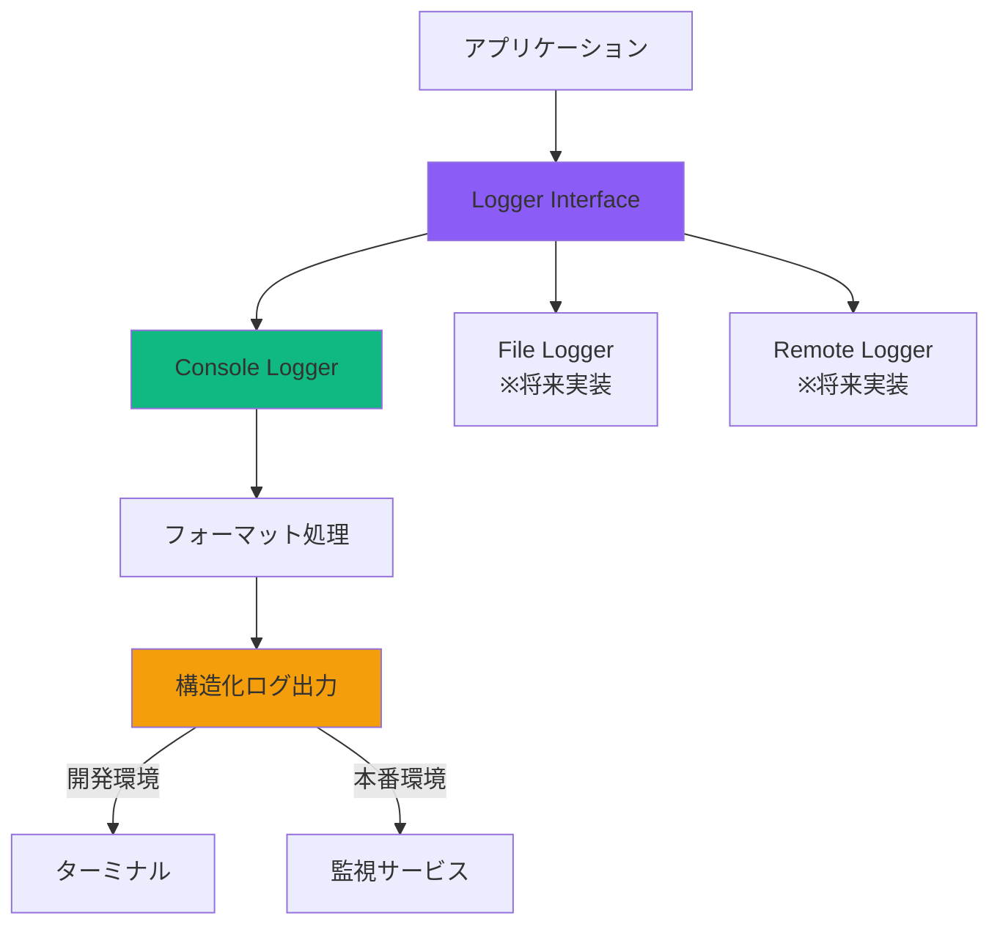
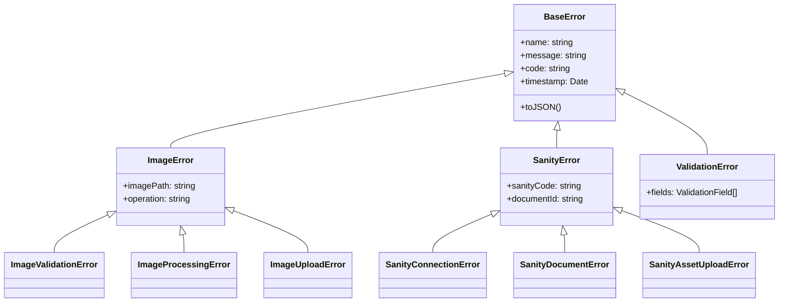
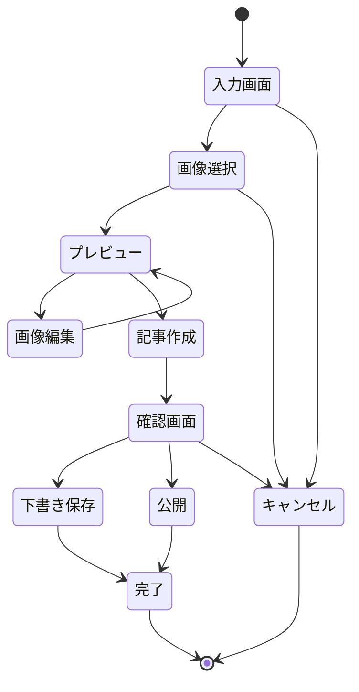

# システム全体構成図

## 🌐 システム全体像

**Excalidraw で作成:** https://excalidraw.com

### 🎨 手書き風システム構成図

この図では、**クリーンアーキテクチャ**の層構造とSanity CMSとの統合を表現しています。

```
┌─────────────────────────────────────────┐
│           Browser (Client)              │
│  ┌─────────────────────────────────────┐ │
│  │          React App                  │ │
│  │                                     │ │
│  │  ┌─────────────────────────────────┐ │ │
│  │  │      Presentation Layer         │ │ │
│  │  │   Pages → Components → Hooks    │ │ │
│  │  └─────────────────────────────────┘ │ │
│  │               ↓                     │ │
│  │  ┌─────────────────────────────────┐ │ │
│  │  │      Application Layer          │ │ │
│  │  │       Use Cases ← Services      │ │ │
│  │  └─────────────────────────────────┘ │ │
│  │               ↓                     │ │
│  │  ┌─────────────────────────────────┐ │ │
│  │  │        Domain Layer             │ │ │
│  │  │  Entities ← Value Objects       │ │ │
│  │  └─────────────────────────────────┘ │ │
│  │               ↓                     │ │
│  │  ┌─────────────────────────────────┐ │ │
│  │  │    Infrastructure Layer         │ │ │
│  │  │   API Clients → Processors      │ │ │
│  │  └─────────────────────────────────┘ │ │
│  │               ↓                     │ │
│  │  ┌─────────────────────────────────┐ │ │
│  │  │         Core Layer              │ │ │
│  │  │  Config → Errors → Logging      │ │ │
│  │  └─────────────────────────────────┘ │ │
│  └─────────────────────────────────────┘ │
└─────────────────────────────────────────┘
                    ↓
┌─────────────────────────────────────────┐
│         External Services               │
│  ┌─────────────────────────────────────┐ │
│  │           Sanity CMS                │ │
│  │  ┌─────────────┐ ┌─────────────────┐│ │
│  │  │ Sanity API  │ │ Assets Storage  ││ │
│  │  └─────────────┘ └─────────────────┘│ │
│  └─────────────────────────────────────┘ │
│                                         │
│  ┌─────────────────────────────────────┐ │
│  │        Hosting & CI/CD              │ │
│  │  ┌─────────────┐ ┌─────────────────┐│ │
│  │  │   GitHub    │ │     Vercel      ││ │
│  │  └─────────────┘ └─────────────────┘│ │
│  └─────────────────────────────────────┘ │
└─────────────────────────────────────────┘
```

### 🎯 アーキテクチャのポイント

1. **依存性の流れ**: 外側 → 内側（クリーンアーキテクチャ）
2. **関心事の分離**: 各レイヤーが明確な責務を持つ
3. **外部統合**: Sanity CMS との疎結合な連携
4. **型安全性**: TypeScript で全体を保護

## 🏛 アーキテクチャパターン

### **クリーンアーキテクチャ + DDD**



**依存性の方向:**
- 外側のレイヤーは内側のレイヤーに依存
- 内側のレイヤーは外側を知らない
- インターフェースによる依存性逆転

## 📊 データフロー

### **記事作成フロー**



## 🔐 型安全性保証システム

### **TypeScript設定階層**



## 🚀 デプロイメントフロー

```mermaid
flowchart LR
    subgraph "開発環境"
        DEV[ローカル開発]
        TEST[テスト実行]
    end
    
    subgraph "CI/CD"
        GHA[GitHub Actions]
        BUILD[ビルド]
        LINT[Linting]
        TYPE[型チェック]
    end
    
    subgraph "本番環境"
        VERCEL2[Vercel]
        CDN[CDN配信]
        PROD[本番サイト]
    end
    
    DEV --> |git push| GHA
    GHA --> BUILD
    GHA --> LINT
    GHA --> TYPE
    
    BUILD --> |成功| VERCEL2
    LINT --> |成功| VERCEL2
    TYPE --> |成功| VERCEL2
    
    VERCEL2 --> CDN
    CDN --> PROD
    
    style DEV fill:#10B981
    style GHA fill:#24292e
    style VERCEL2 fill:#000000,color:#fff
    style PROD fill:#3B82F6
```



## 📈 パフォーマンス最適化

### **画像処理パイプライン**



## 🔍 監視とロギング

### **ロギングシステム**



## 🛡 エラーハンドリング

### **エラー階層構造**



## 🎨 UI/UXフロー

### **記事作成画面フロー**



## 📱 レスポンシブ対応

### **ブレークポイント戦略**

```
┌─────────────────────────────────────────────────┐
│  Mobile First Approach                          │
├─────────────────────────────────────────────────┤
│  320px  │  768px  │  1024px  │  1280px  │      │
│    SM   │    MD   │    LG    │    XL    │ 2XL  │
├─────────┼─────────┼──────────┼──────────┼──────┤
│ Mobile  │ Tablet  │  Laptop  │ Desktop  │ Wide │
└─────────┴─────────┴──────────┴──────────┴──────┘
```

## 🔄 今後の拡張計画

1. **マイクロサービス化**
   - 画像処理サービスの分離
   - APIゲートウェイの導入
   - サービスメッシュの検討

2. **AI/ML統合**
   - 画像認識API連携
   - 自動タグ付け
   - コンテンツ推薦

3. **リアルタイム機能**
   - WebSocket通信
   - リアルタイムプレビュー
   - 協調編集機能